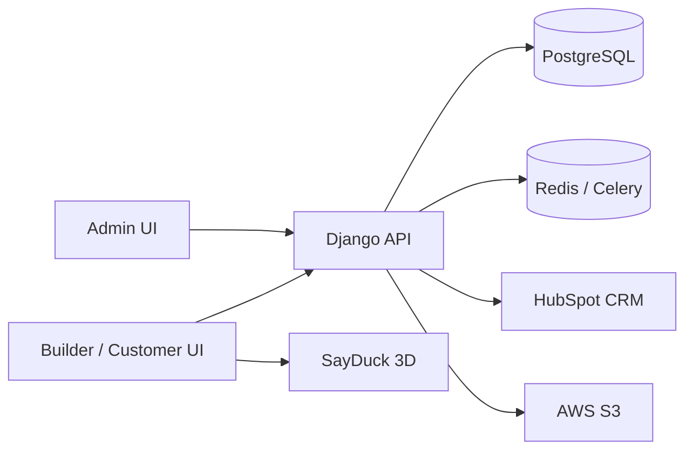

# Mezzanine — Builder Network & 3D Stair Quoting Platform

**Client:** S&A Stairs  
**Type:** B2B SaaS (multi-tenant builder network)  
**Role:** Full-stack engineer

> Case study only — proprietary application source is not published here.

## Problem

S&A Stairs managed a growing builder network — different branding, catalogues, pricing, and permissions per builder — using spreadsheets, email, and tribal knowledge of pricing rules. Consultants quoted from paper, homeowners could not visualize the stair, invalid designs reached the factory, and every won quote had to be re-typed into an order.

## Solution

Mezzanine gives S&A one place to run its builder network, while each builder gets a branded site to design stairs in 3D, get a live price, and turn a quote into an order without re-typing.

**End-to-end flow:**

```text
Builder setup → Catalogue & pricing → 3D consultation → Quote → Order → CRM sync
```

### What this solved

- Replaced spreadsheet/email builder management with one platform
- Builder-specific pricing (rates, extras, promotions, travel) without a specialist
- Eliminated re-typing between quote and order
- Connected the customer-facing sales experience to CRM (HubSpot) automatically
- Guardrails against invalid designs before they reach the factory

## Architecture (high level)



## Tech stack

| Layer | Technologies |
|-------|----------------|
| Frontend | React, Next.js, Vite, TypeScript, Redux Toolkit, MUI, Tailwind, Axios |
| Backend | Django, Django REST Framework, JWT, PostgreSQL, Celery, Redis |
| Integrations | SayDuck (3D), HubSpot, OpenAPI |
| Infra | Docker, GitHub Actions, AWS EC2, AWS S3, WeasyPrint |

## Outcomes

- Single source of truth for builders, catalogues, and pricing
- Live 3D design → priced quote → order in one workflow
- Automatic CRM sync for won opportunities

## Related

- Profile: [Azhar-Sharif](https://github.com/Azhar-Sharif)
